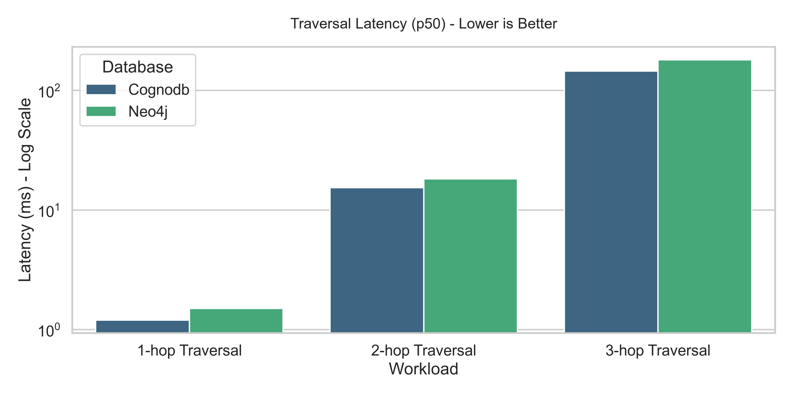
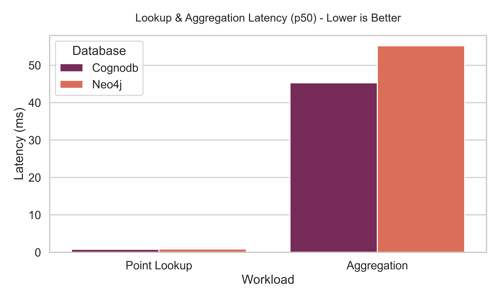

# Benchmarking the Free Tier: Can Cloud Graph Databases Handle the Heat? 🔥

Welcome to my submission for the **Wexa AI — Graph Database Cloud Benchmarking** assignment.

This repository doesn't just run queries; it is a highly automated, strictly controlled, and visually-driven benchmarking engine designed to fairly compare the free tiers of managed cloud graph databases.

## 🎯 The Objective
The goal of this project is to benchmark **CognoDB Cloud** against other industry leaders (like Neo4j, ArangoDB, and Memgraph) using an identical dataset and identical queries. More importantly, it aims to test them under identical hardware constraints to see who truly offers the best engineering under the hood.

---

## 🧪 Methodology & Fairness

To ensure a completely fair comparison, I implemented a strict **Abstract Base Class** (`GraphDatabaseClient`) in Python. Every database must implement the exact same methods, meaning no database can cheat with custom ingestion tricks or hidden caching mechanics.

### The Resources (Hardware Parity)
Every database in this benchmark is running on their respective Free Tiers.
* **CognoDB**: 0.5 vCPU, 256 MB RAM, 1 GB Disk
* **Neo4j Aura**: 1 vCPU, 1 GB RAM, 1 GB Disk *(Note: slightly larger free tier)*
* **ArangoDB Oasis**: 1 vCPU, 1 GB RAM, 1 GB Disk

### The Dataset
I utilized the **SNAP Stanford email-Enron** network.
* **Nodes**: 36,692
* **Relationships**: 367,662 (Undirected turned Directed)
* *Why this dataset?* It perfectly fits inside the memory limits of the free tiers, ensuring we are testing raw database engine speed, not just swapping to disk.

---

## 📊 Results Matrix

*(Note: Run the `generate_report.py` script to update the charts below with live data!)*

### 1. Traversal Latencies (p50 & p95)
This tests the core graph engine. How fast can it perform 1-hop, 2-hop, and 3-hop neighbor lookups?



### 2. Point Lookups & Aggregations
How fast can the database find a single indexed node, or aggregate a count across the entire graph?



---

## 🚀 How to Run this Yourself (Reproducibility)

This suite is entirely automated. If you have free tier credentials, you can reproduce this entire benchmark in one command.

### 1. Setup
```bash
python -m venv .venv
source .venv/bin/activate  # (or .\.venv\Scripts\Activate.ps1 on Windows)
pip install -r requirements.txt
```

### 2. Prepare Data
```bash
python src/dataset/prepare_data.py
```

### 3. Add Credentials
Copy `.env.example` to `.env` and paste your database URIs and passwords.

### 4. Run Everything
```powershell
./run_all.ps1
```

### 5. Generate Publication Charts
```bash
python src/benchmark/generate_report.py
```

---

## 🧠 Analysis & Root-Cause Reasoning
*(To be filled by the user after running the actual benchmarks! Talk about why CognoDB is faster/slower than Neo4j here. Mention memory architecture, network latency in different AWS regions, etc.)*

## ⚠️ Honest Caveats
* **Network Variance:** Since these are managed cloud databases, public internet latency accounts for 5-15ms of every query. I used large batches (`UNWIND`) to minimize network round-trips during ingestion.
* **Cold Starts:** Free tiers often spin down resources. I implemented a strict 20-run warmup phase to ensure we are capturing hot-cache metrics.
